# Docker - Lab 1

## Task 1

### 1. Run container from any image

```sh
sudo docker container run --name test-container -it ubuntu
```

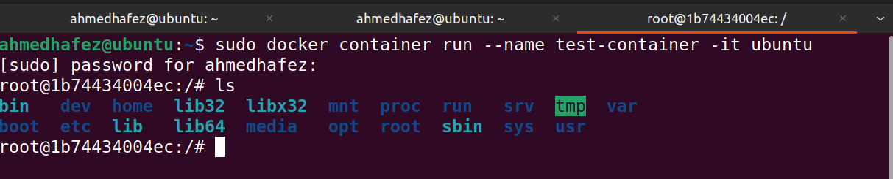

### 2. Check the container status

```sh
sudo docker container ls -a
```

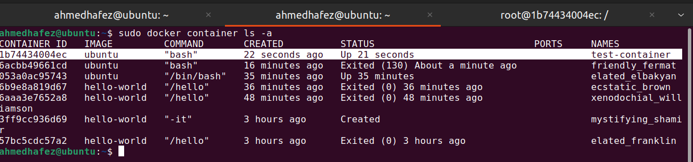

### 3. Start the stopped container

```sh
sudo docker container start test-container
```

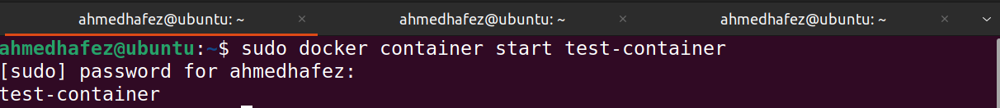

### 4. Remove the container

```sh
sudo docker container run --name new-container -it ubuntu

sudo docker container rm new-container
```

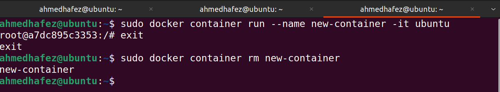

### 5. Remove the image

```sh
sudo docker images
sudo docker pull ubuntu:18.04
sudo docker image rm ubuntu:18.04
sudo docker image -ls
```

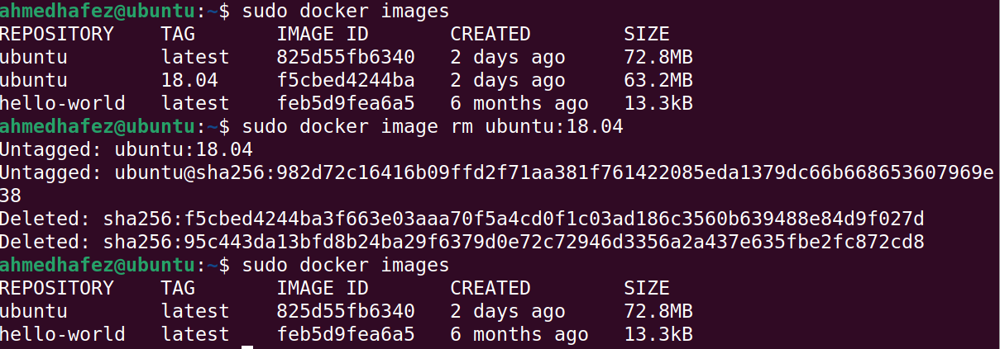

---

## Task 2

### 1. Run container centos or ubuntu in an interactive mode

### 2.Run the following command in the container “echo docker ”

### 3. Open a bash shell in the container and touch a file named hello-docker

```sh
sudo docker container run --name new-container -it ubuntu
```

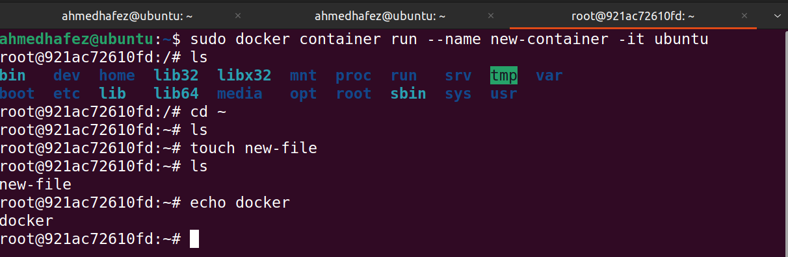

### 4. Stop the container and remove it

```sh
sudo docker container rm new-container
```


### 5. Remove all stopped containers

```sh
sudo docker container prune
sudo docker container ls -a
```

##screenshot_8 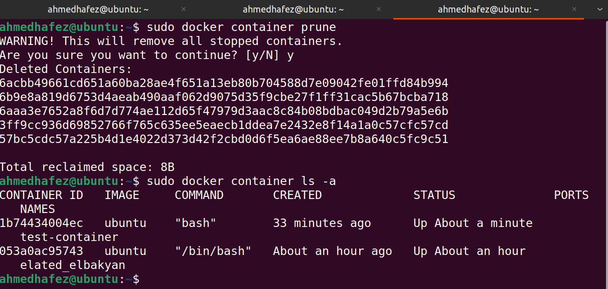

---

## Task 3

### 1. Run a container httpd with name apache

### 2. Remove the container

```sh
sudo docker container run --name test-apache -id httpd
sudo docker stop test-apache
sudo docker container rm test-apache
```

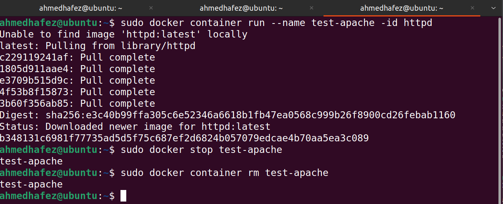

### 3. Run a new container with the following:

- Map port 80 to port 9898 on your host machine
- Access the html files from your browser

```sh
sudo docker run -d -p 127.0.0.1:9898:80 --name httpd-container -it httpd
```

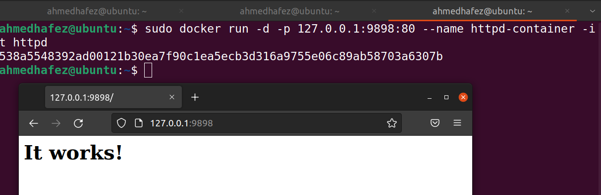
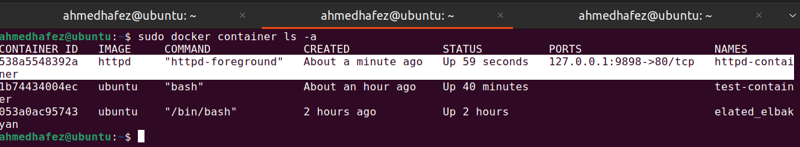

---

## Task 4

### 1. Run the image httpd again.

### 2. Add html static files to the container and make surethey are accessible

```sh
sudo docker start httpd-container
sudo docker container exec -it httpd-container bash

cd /usr/local/apache2
git clone https://github.com/ShaifArfan one-page-website-html-css-project.git htdocs
```

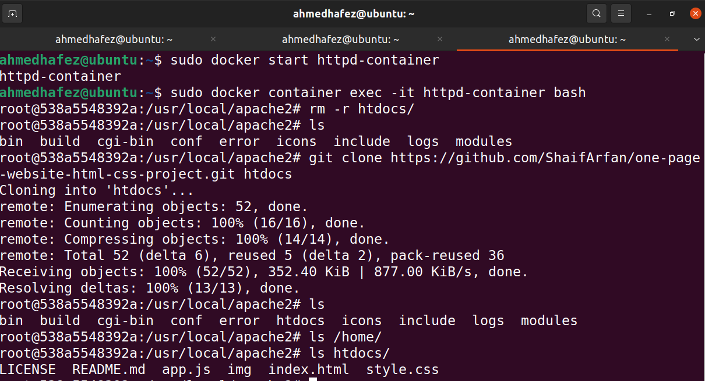


### 3. Commit the container with image name IMAGE_NAME

```sh
sudo docker commit 538a5548392a ahmedhafez13 httpd-container
sudo docker images
```

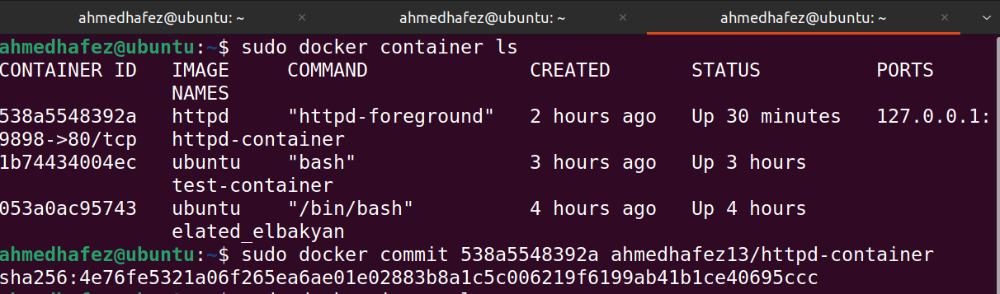
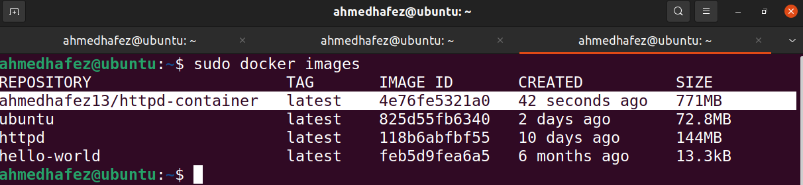

---

## Task 5

### Deploy a MySQL database called app-database. Use the mysql latest image, and use the -e flag to set MYSQL_ROOT_PASSWORD to P4sSw0rd0!. The container should run in the background.

```sh
sudo docker container run --name mysql-container -p 127.0.0.1:3306:3306 -e MYSQL_ROOT_PASSWORD=P4sSw0rd0! -id mysql

sudo docker container ls -a
```

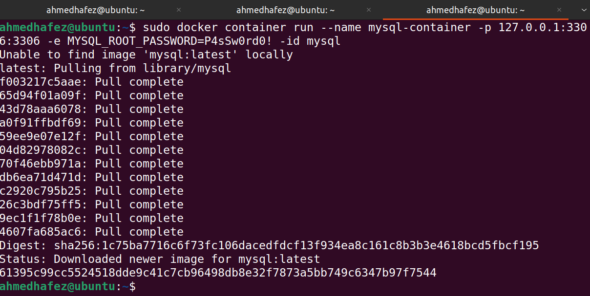
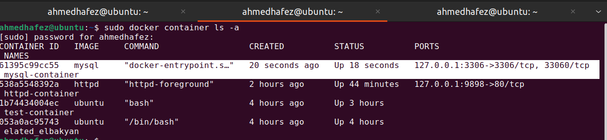
