# Docker - Lab 2

## Task 1

### 1. Create bridge network with subnet 192.168.0.0/24.

```sh
sudo docker network create -d bridge --subnet=192.168.0.0/24 net1
```

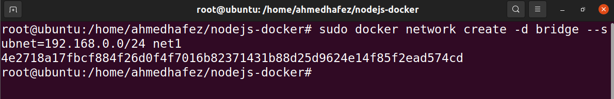

### 2. Run 2 containers and attach containers to this network.

```sh
sudo docker run --name net1_cont1 --network net1 -dit ubuntu
sudo docker run --name net1_cont2 --network net1 -dit ubuntu
```

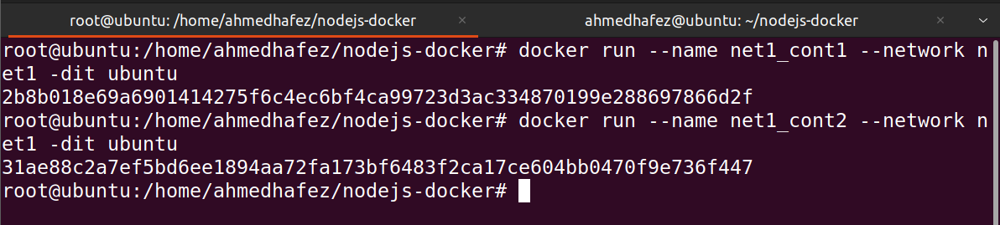

### 3. Create another bridge network with subnet 10.5.0.0/24.

```sh
sudo docker network create -d bridge --subnet=10.5.0.0/24 net2
```

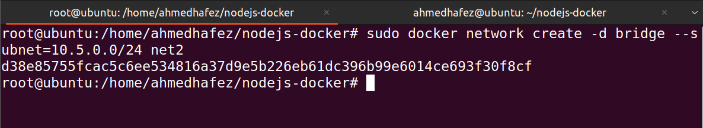

### 4. Run any container and attach it to the new network.

```sh
sudo docker run --name net2_cont1 --network net2 -dit ubuntu
```

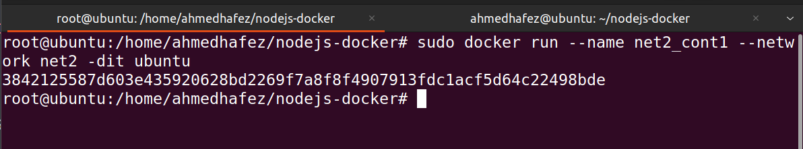

### 5. Make sure that the containers at different network can’t ping each other

```sh
docker container exec -it net1_cont1 bash
docker container exec -it net1_cont2 bash
docker container exec -it net2_cont1 bash

apt update
apt install iproute2 -y
apt install iputils-ping
```

> net1_cont1 with ip: 192.168.0.2/24
>
> net1_cont2 with ip: 192.168.0.3/24
>
> net2_cont1 with ip: 10.5.0.2/24

#### ping from net1_cont1 on net1_cont2

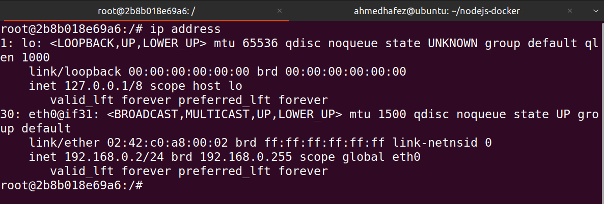

#### ping from net1_cont2 on net1_cont1

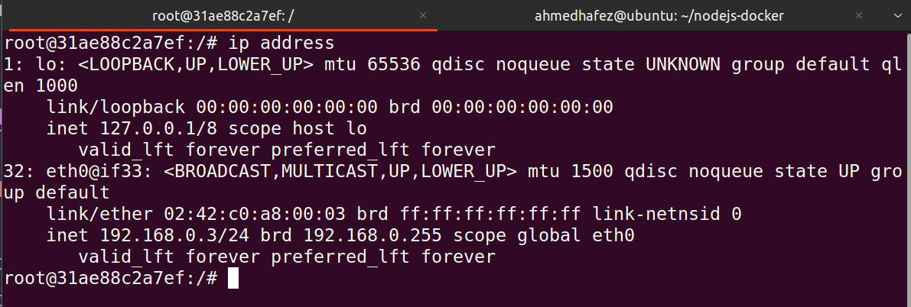

#### ping from net2_cont1 on net1_cont1 and net1_cont2|

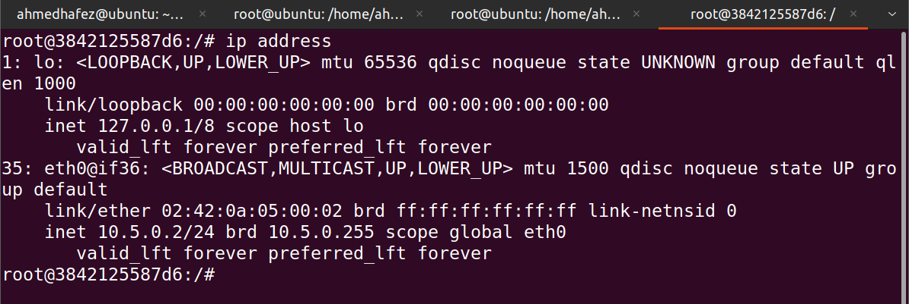

---

## Task 2

### Create static html file

### Write Dockerfile to build image based on httpd to host the html file and

- specify the following
  - Copy the html file.
  - Open the port 9999 in the container
  - Add environment variable CONTAINER with value docker .

```Dockerfile
FROM httpd:2.4
RUN mkdir /temp-project
COPY index.html /usr/local/apache2/htdocs
COPY custom-httpd.conf /usr/local/apache2/conf/httpd.conf
EXPOSE 9999
ENV CONTAINER docker
```

```sh
sudo docker build -t static-webpage:v1.0 .
sudo docker run -dit -p 9999:9999 --name test_container static-webpage:v1.0
```

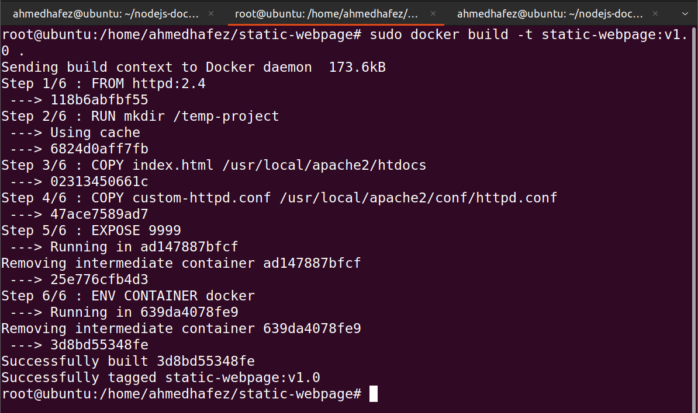
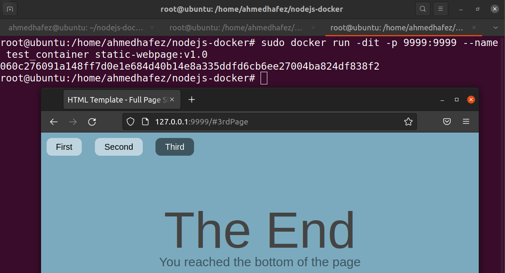

---

## Task 3

### Run a container httpd with name apache and attach 2 volumes

- to the container
- Volume1 for containing static html file
- Volume2 for containing httpd configuration

```sh
sudo docker volume create static_html_vol
sudo docker volume create httpd_conf_vol
```

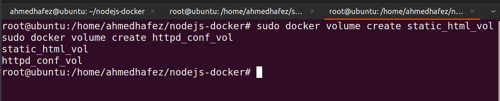

```sh
sudo docker run -dit --name test_container -p 8080:80 -v static_html_vol:/usr/local/apache2/htdocs -v httpd_conf_vol:/usr/local/apache2/conf httpd:latest
```

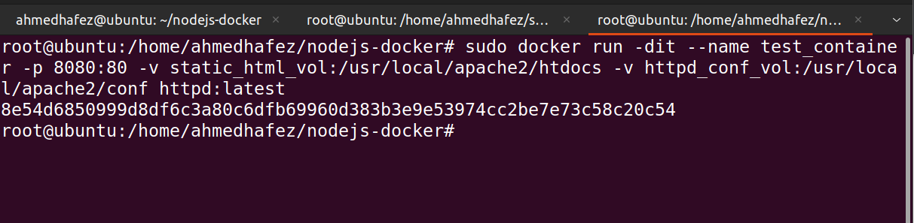

---

## Task 4

### Create a Dockerfile to deploy weather-app application

```sh
sudo docker build -t node-app:v1.0 .
```

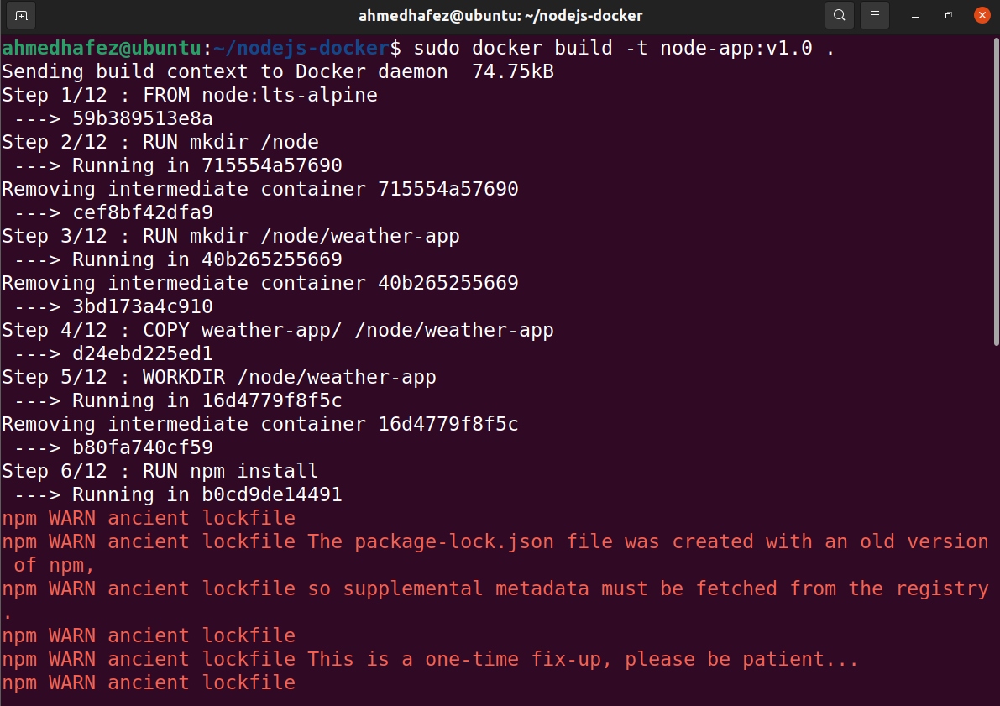
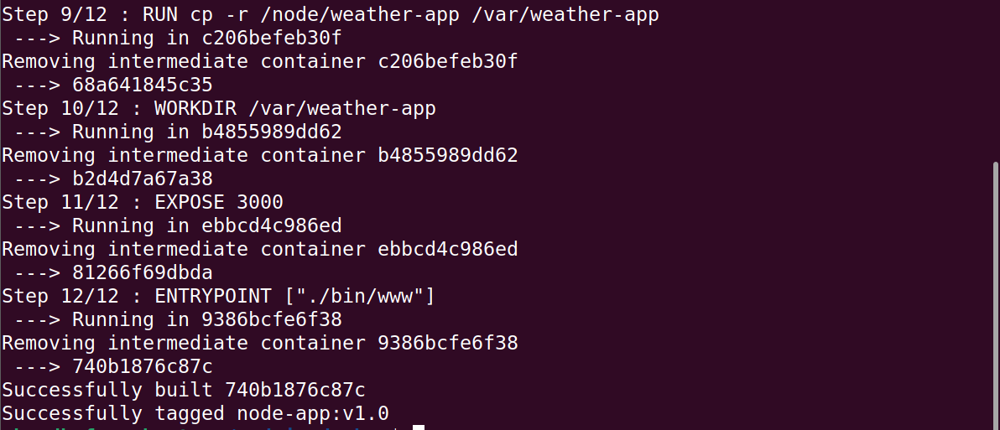
