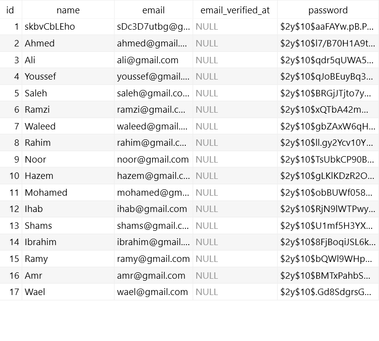

# Database: Seeding

### 1. Create a new seeder for user

```
php artisan make:seeder UserSeeder
```

### 2. Use `DB::table()->insert` to insert into users table

`DB::table('users')->insert([]);`

```php
<?php

namespace Database\Seeders;

use Illuminate\Database\Console\Seeds\WithoutModelEvents;
use Illuminate\Database\Seeder;
use Illuminate\Support\Facades\DB;
use Illuminate\Support\Facades\Hash;
use Illuminate\Support\Str;

class UserSeeder extends Seeder
{
    /**
     * Run the database seeds.
     *
     * @return void
     */
    public function run()
    {
        $users = [
            ['Ahmed', 'ahmed', '12345'],
            ['Ali', 'ali', '12345'],
            ['Youssef', 'youssef', '12345'],
            ['Saleh', 'saleh', '12345'],
            ['Ramzi', 'ramzi', '12345'],
            ['Waleed', 'waleed', '12345'],
            ['Rahim', 'rahim', '12345'],
            ['Noor', 'noor', '12345'],
            ['Hazem', 'hazem', '12345'],
            ['Mohamed', 'mohamed', '12345'],
            ['Ihab', 'ihab', '12345'],
            ['Shams', 'shams', '12345'],
            ['Ibrahim', 'ibrahim', '12345'],
            ['Ramy', 'ramy', '12345'],
            ['Amr', 'amr', '12345'],
            ['Wael', 'wael', '12345'],
        ];
        foreach ($users as $user) {
            DB::table('users')->insert([
                'name' => $user[0],
                'email' => $user[1] . '@gmail.com',
                'password' => Hash::make('password'),
            ]);
        }
    }
}
```

### 3. Run the seed

```
php artisan db:seed --class=UserSeeder
```

### 4. Result

